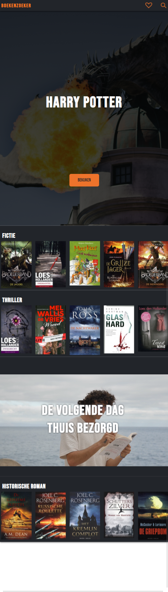
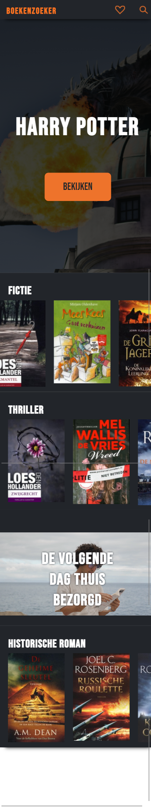
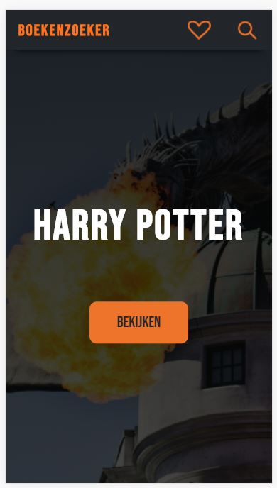
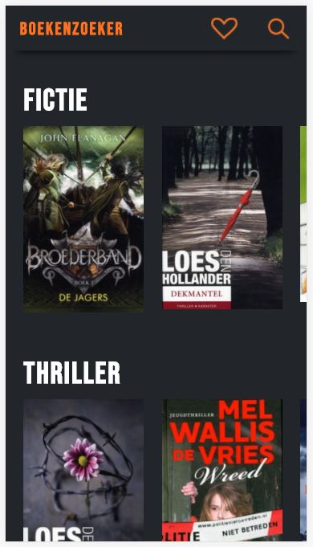
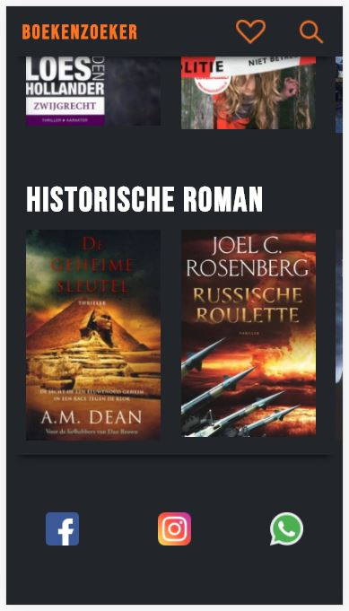
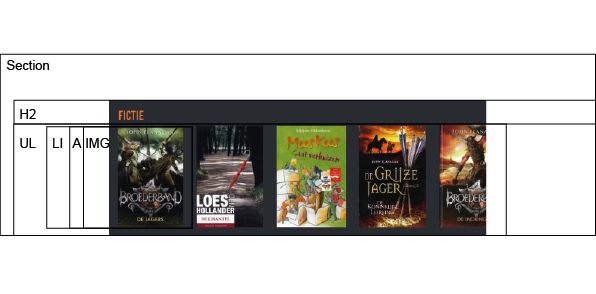
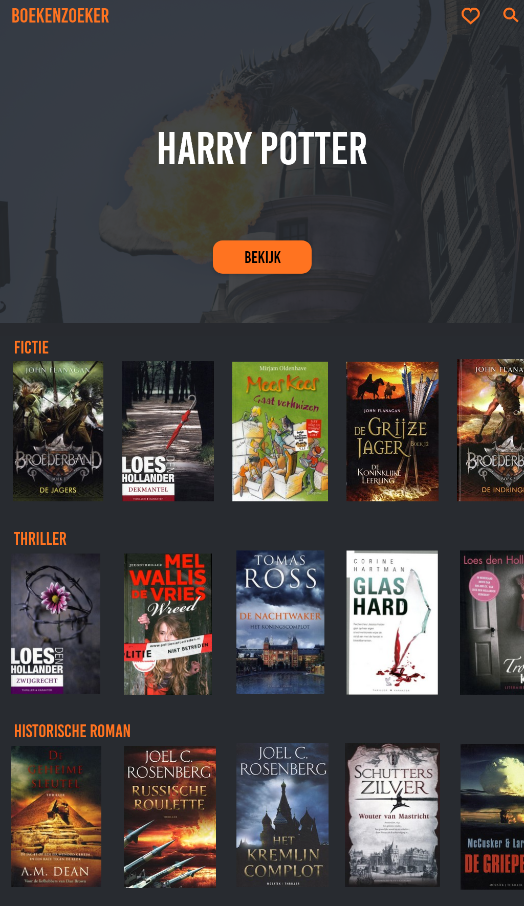

# Procesverslag
**Auteur:** Aron Pelgrim

Markdown cheat cheet: [Hulp bij het schrijven van Markdown](https://github.com/adam-p/markdown-here/wiki/Markdown-Cheatsheet). Nb. de standaardstructuur en de spartaanse opmaak zijn helemaal prima. Het gaat om de inhoud van je procesverslag. Besteedt de tijd voor pracht en praal aan je website.

## Bronnenlijst
1. https://codepen.io/shooft/pen/zYqJLvZ
2. https://codepen.io/shooft/pen/qBZPdGm
3. https://www.w3schools.com/howto/howto_css_fullscreen_video.asp

## Eindgesprek (week 7/8)

-dit ging goed & dit was lastig-
De laatste periode ben ik vooral bezig geweest met het toevoegen van animaties, het toevoegen van Javascript en het maken van de tweede pagina. Ook ben ik bezig geweest om te kijken hoe ik mijn css code kon inkorten door dubbele code weg te halen. Verder ben ik nog bezig geweest met de vormgeving van de content. Die is op dit moment beter presenteerbaar naar mijn mening. Wat eigenlijk makkelijk ging waren het toevoegen van aninmaties en het inkorten van de css. Ik had nooit eerder met keyframes gewerkt, maar door de oefeningen in de les ging dit vrij gemakkelijk. Verder kwam ik erachter dat ik wat css code algemener kon maken (het gaat om de h2 van de sections op de index). Wat ik deze keer wat lastiger vond was het maken van het favorietenlijstje. Ondanks dat er een goed voorbeeld was van de oefeningen, had ik toch wat moeite om deze werkend te maken. Ik moest daarom eerst de code goed snappen om die om mijn eigen pagina toe te passen. Verder ben ik dus ook bezig geweest met de detailpagina. Dit was aan het begin lastig omdat ik sections anders wilde stijlen, dit was niet mogelijk omdat ik geen classes had gebruikt. Ik heb daarom besloten om wel classes te gebruiken op de main, zodat ik de code specifiek per pagina kon maken.

**Screenshot(s):**

Dit is de indexpagina, (footer laadt niet snel genoeg voor de screenshot).

Dit is de detailpagina, (footer laadt niet snel genoeg voor de screenshot).

## Voortgang 3 (week 6)

### Stand van zaken

-dit ging goed & dit was lastig-
Deze week ging verliep vrij soepel. Qua nieuwe content heb ik weinig toegevoegd, behalve een grid met wat een aantal afbeeldingen. Voor de rest ben ik
begonnen met de website toegankelijk maken voor screenreaders, hier ben ik een klein beetje op vast gelopen. Het is namelijk niet mogelijk om over met de tab knop
te komen. Wat wel is gelukt, is het responsive maken van de website. Voorheen was het al gelukt dat de typografie en andere elementen met de pagina meeschalen,
maar als de pagina te groot of te klein werd, zouden deze elementen niet meer kloppen. Ik had daarom een minimun en maximum grootte nodig.
Ik ben op advies van Marvin gaan kijken naar clamp. Na een aantal dingen hierover gelezen te hebben, heb ik dit succesvol toegepast in de website. Qua responisvenes
werkt de website nu dus goed.

**Screenshot(s):**

Op de pagina zelf is nu de grid 'uitgelicht' toegevoegd. Verder zijn alle aanpassingen in de code plaatsgevonden, qua responisvenes en toegankelijkheid.
De footer is nu niet te zien, dat komt doordat deze fixed is en niet snel genoeg laadt voor de screenshot.

### Agenda voor meeting

-samen met je groepje opstellen-

| Aron             | Christiaan         | Menno            | Eva              |
| ---              | ---                | ---              | ---              |
|Een probleem met  |
|toegankelijkheid  |
|voor screenreader.|

### Verslag van meeting
We hebben deze keer vooral naar de voortgang gekeken van de websites. Ik had zelf nog een
probleempje met de screenreader, als ik met tab over de elementen heen wilde gaan, pakte de screenreader niet alles. Er is mij nu verteld dat dat komt omdat dat alleen gebeurt als het element een button of link is. Verder is er een goede uitleg gegeven over wat je kan doen met ::before en ::after. Tot slot heb ik mijn website even laten zien aan het groepje omdat ik clamp had toegevoegd.

## Verslag screenreader

Als test om te zien of mijn website voor iedereen toegankelijk is, ben ik met de screenreader over mijn website heengegaan. Ik kwam er gelijk achter dat deze met de Tab toets alleen over de elementen van de header gaat en de button van de eerste section. Wat na de header komt is niet te bereiken met deze toets. De links in de menubalk worden goed voorgelezen, dit zijn namelijk afbeeldingen voorzien van alt tekst. Ook de button van de eerste section wordt goed voorgelezen. Door de rest van de pagina kan je wel klikken met de muis, wat niet bepaald toegankelijk is. Wat er dan door de screenreader wordt voorgelezen is ook niet bepaald duidelijk. Dit moet dus nog verbeterd worden.

## Voortgang 2 (week 5)

### Stand van zaken

-dit ging goed & dit was lastig-
Ik vond het lastig om te zien hoe ik de pagina het beste responsive kon maken. Ik heb uiteindelijk met calc gewerkt om
zo het formaat van elementen responsive te maken. Verder heb ik een achtergrondvideo toegevoegd waarbij het positioneren
wat lastig bleek, dit is uiteindelijk wel gelukt. Dit video element heb ik met een media query responsive moeten maken.

**Screenshot(s):**

Dit is de pagina die iets is geupdate, hij is nu responsive, dus ook voor desktop formaat.

Dit is de pagina die iets is geupdate, hij is nu responsive, dus ook voor tablet formaat.

Dit is de pagina die iets is geupdate, op de telefoon formaat.

### Agenda voor meeting

-samen met je groepje opstellen-

| Aron           | Christiaan         | Menno            | Eva              |
| ---            | ---                | ---              | ---              |
| Responsive mak-| CSS positioneren   | Element centreren|                  |
| en de beste    | met zo min mogelijk| met CSS.         |                  |
| opties daarvan.| herhaling.         |                  |                  |

### Verslag van meeting
De meeting is goed verlopen. Ik heb te horen gekregen dat de beste manier om elementen responsive te maken, is om clamp te gebruiken. Daarbinnen is het beste om met variabele te werken. Dat is dan ook iets wat ik ga aanpassen. Verder hebben wij allemaal het advies gekregen om vaker updates van de website, direct te commiten in github. Ook kregen wij het advies om de documentatie wat uitgebreider te omschrijven. Daar zal ik dan ook meer op gaan letten. Tot slot werd er gezegd dat iedereen uit het groepje goed op schema liep qua website.

## Voortgang 1 (week 3)

### Stand van zaken

-dit ging goed & dit was lastig-
Ik vond het vooral lastig om een begin te maken. Ik wist niet goed hoe ik de code wilde opstellen,
ook omdat ik voorheen altijd met id tags heb gewerkt. Nadat ik de header had gemaakt, had ik een beetje door hoe ik de css goed kon aanspreken.
De oefeningen met het positioneren kwamen nu ook goed van pas dus toen ik eenmaal bezig was ging de eerste
pagina redelijk snel. Bij de carrousels met boeken heb ik voornamelijk naar het voorbeeld gekeken die we in de les hebben gekregen.
De footer wilde ik fixed maken en dat ging een beetje moeizaam, omdat deze onder de main bleef zitten. Na een margin bottom aan de laatste
main section gegeven te hebben, werd de footer wel zichtbaar.

**Screenshot(s):**

Dit is de header van de pagina en een achtergrond met een linear gradient eroverheen.

Dit zijn meerdere sections onder elkaar inde vorm van een caroussel, met daarin verschillende boeken.

Onder aan de pagina is een fixed footer te zien met daarin social media links.

### Agenda voor meeting

-samen met je groepje opstellen-

| Aron           | Christiaan         | Menno            | Eva              |
| ---            | ---                | ---              | ---              |
| Het kort houden| HTML controlleren. |Html controlleren.|                  |
| van CSS code.  | Positionering.     |                  |                  |
| Semantiek.     |                    |                  |                  |

### Verslag van meeting

Het is goed om de CSS goed te organiseren en niet code dubbel te gebruiken als dat niet nodig is.
Het is voor mij handig om variabele te gebruiken voor de kleurthema's. Zo kan ik verschillende thema's maken.

## Breakdownschets (week 1)

## Intake (week 1)
-uitwerken voor de kick-off werkgroep - begin van de eerste week-

**Je startniveau:** -Rood-

**Je focus:** -Responsive-

**Je opdracht:** -De boekenzoeker-

**Screenshot(s) van de eerste pagina (small screen):**

**Screenshot(s) van de tweede pagina (small screen):**

